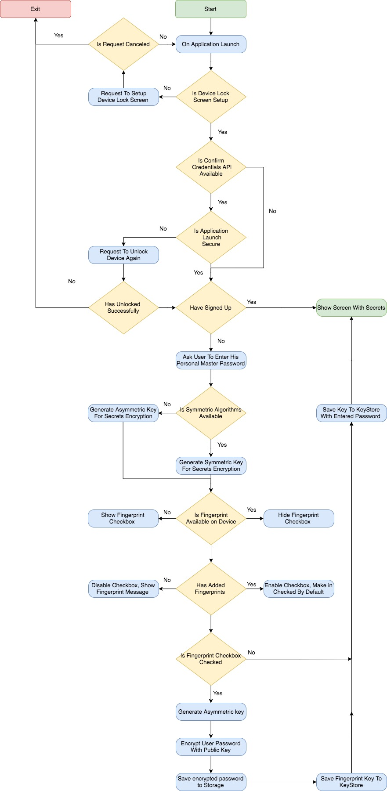

# Secrets Keeper

Secrets Keeper is a simple secure application that uses Android Key Store API, Fingerprint API and Confirm Credentials API to keep your secrets in safe.

> _**Note.** This project is work in progress. Design, Workflow and end Goals can be changed during development._

## Environment setup

To be able to build this project on your local machine, please follow the below instructions:

- Download and install latest [Android Studio 3.0](https://developer.android.com/studio/preview/index.html)
- Download and install all dependencies that Gradle ask's you to
- Download and install Android Virtual Device(AVD) with API 23, using build in Android Virtual Device Manager from Android Studio
- To cover compatibility issues and support newest features, probably, you will also need to install AVD API 18 and AVD API 24+

## Technologies Stack

- Android 18+
- Kotlin
- AndroidKeyStore API
- Fingerprint API
- Confirm Credentials API
- Safety Net API

## Goals

- Build application based on Android Fingerprint Sample
- Use JCA to show how to use encryption in Android
- Use encryption to protect secrets
- Use fingerprint get access to protected secrets
- Use confirm credentials to protect application overall
- Keep it simple

## Launch Workflow




## Security Code Snippets

- Create `KeyStore`instance and prepare it for working using `AndroidKeyStore` provider:

```kotlin
val keyStore = KeyStore.getInstance("AndroidKeyStore")
keyStore.load(null)
```

- Get information about keys currently existed in keystore:

```kotlin
// Define data class to store key info
data class KeyData(val alias: String, val creationDate: Date)
val keyData = keyStore.aliases().toList().map { KeyData(it, keyStore.getCreationDate(it)) }
```

- Prepare `KeyGenerator` instance for generating and saving `AES` symmetric keys using `AndroidKeyStore` provider:

```kotlin
val generator = KeyGenerator.getInstance(algorithm, "AndroidKeyStore")


val builder = KeyGenParameterSpec.Builder(alias, KeyProperties.PURPOSE_ENCRYPT or KeyProperties.PURPOSE_DECRYPT)
                .setBlockModes(KeyProperties.BLOCK_MODE_CBC)
                .setUserAuthenticationRequired(userAuthenticationRequired)
                .setEncryptionPaddings(KeyProperties.ENCRYPTION_PADDING_PKCS7)
                .setInvalidatedByBiometricEnrollment(invalidatedByBiometricEnrollment)

generator?.init(builder.build())

// This will create and save key to KeyStore
val key = keyGenerator?.generateKey()
```

- Prepare `KeyPairGenerator` instance for generating and saving `RSA` asymmetric key pairs using `AndroidKeyStore` provider:

```kotlin
val generator = KeyPairGenerator.getInstance(keyProps.mKeyType, provider);

val startDate = Calendar.getInstance()
val endDate = Calendar.getInstance()
endDate.add(Calendar.YEAR, 20)

val builder = KeyGenParameterSpec.Builder(alias, KeyProperties.PURPOSE_ENCRYPT or KeyProperties.PURPOSE_DECRYPT)
                .setCertificateSerialNumber(BigInteger.ONE)
                .setCertificateSubject(X500Principal("CN=${alias} CA Certificate"))
                .setCertificateNotBefore(startDate.time)
                .setCertificateNotAfter(endDate.time)
                .setBlockModes(KeyProperties.BLOCK_MODE_ECB)
                .setEncryptionPaddings(KeyProperties.ENCRYPTION_PADDING_RSA_PKCS1)

generator.initialize(generator.build())

// This will create and save key to KeyStore
val keyPair = generator?.generateKeyPair()
```

## Resources

### Kotlin

- https://kotlinlang.org/docs/reference/kotlin-doc.html

### Cryptography

- http://docs.oracle.com/javase/7/docs/technotes/guides/security/crypto/CryptoSpec.html
- https://developer.android.com/training/articles/keystore.html
- https://source.android.com/security/keystore/
- https://github.com/yakivmospan/scytale

### Fingerprint & Credentials API

- https://developer.android.com/about/versions/marshmallow/android-6.0.html#fingerprint-authentication
- https://developer.android.com/about/versions/marshmallow/android-6.0.html#confirm-credential
- https://github.com/googlesamples/android-FingerprintDialog
- https://www.youtube.com/watch?v=VOn7VrTRlA4

### Key Attestation

- https://developer.android.com/training/articles/security-key-attestation.html
- https://developer.android.com/training/safetynet/index.html
- https://github.com/googlesamples/android-key-attestation
- https://github.com/googlesamples/android-play-safetynet/
